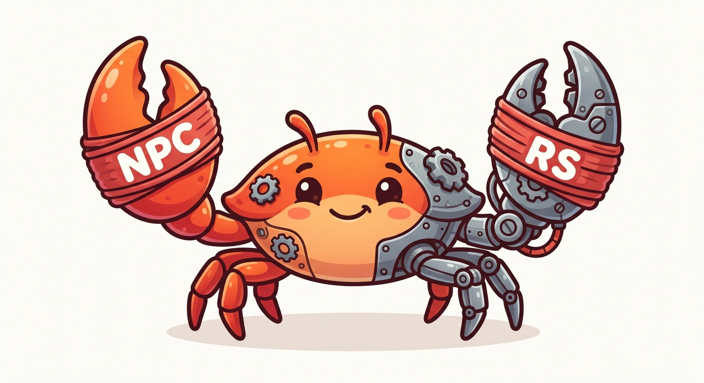

# npcrs



Rust core for the NPC system. Mirrors [npcpy](https://github.com/NPC-Worldwide/npcpy) for function parity.

## Modules

| Module | npcpy equivalent | Description |
|--------|-----------------|-------------|
| `npc_compiler` | `npcpy.npc_compiler` | NPC, Team, Jinx, Agent/ToolAgent/CodingAgent |
| `gen` | `npcpy.gen` | LLM response (genai), cost, sanitization, image gen |
| `llm_funcs` | `npcpy.llm_funcs` | `get_llm_response()`, `check_llm_command()` |
| `memory` | `npcpy.memory` | Conversation history, knowledge graph, embeddings, search |
| `tools` | `npcpy.tools` | Tool registry, `flatten_tool_messages()` |
| `data` | `npcpy.data` | Web search, file loading, text processing |
| `work` | `npcpy.work` | Job scheduling, triggers |
| `ml_funcs` | `npcpy.ml_funcs` | ML model fit/predict/score (via Python subprocess) |
| `npc_array` | `npcpy.npc_array` | Vectorized inference, ensemble voting |
| `mix` | `npcpy.mix` | Multi-agent debate |
| `ft` | `npcpy.ft` | Fine-tuning (SFT via Python subprocess) |
| `kernel` | — | OS kernel: process table, scheduling, IPC (Rust-specific) |
| `process` | — | NPC process lifecycle, resource limits |
| `serve` | `npcpy.serve` | HTTP REST API + MCP server |
| `ffi` | — | C-ABI for Flutter/Dart/mobile |

See [COVERAGE.md](COVERAGE.md) for detailed function-by-function parity status.

## Build

```bash
cargo build --release
```

## Usage as library

```rust
use npcrs::{Kernel, NPC, Team};

// Boot kernel with a team directory
let kernel = Kernel::boot("./npc_team", "~/npcsh_history.db")?;

// Execute through the agent loop (tools, delegation, etc.)
let output = kernel.exec(0, "what files are in this directory?").await?;

// Delegate to a specific NPC
let output = kernel.delegate(0, "corca", "refactor this function").await?;
```

## Usage as npcsh (shell)

Build and run from `npcsh/rust/`:

```bash
cd npcsh/rust
cargo build --release
./target/release/npcsh
```

Or symlink as `npc` for direct .npc/.jinx execution:

```bash
ln -sf $(pwd)/target/release/npcsh ~/.local/bin/npc

# Run NPC files directly
npc ./npc_team/sibiji.npc "hello"

# Run jinx files directly
npc ./npc_team/jinxes/lib/sh.jinx bash_command="echo hi"

# Scaffold a new team
npc init
```

## Persistent socket daemon (recommended)

By default `npcsh` spawns a Python daemon subprocess per session. For faster startup and concurrent request handling, run the daemon as a persistent service.

### macOS (launchd)

```bash
# Install the launchd plist
cp scripts/com.npcworldwide.npcsh-daemon.plist ~/Library/LaunchAgents/
launchctl load ~/Library/LaunchAgents/com.npcworldwide.npcsh-daemon.plist
launchctl start com.npcworldwide.npcsh-daemon

# Stop / unload
launchctl stop com.npcworldwide.npcsh-daemon
launchctl unload ~/Library/LaunchAgents/com.npcworldwide.npcsh-daemon.plist
```

Logs: `tail -f /tmp/npcsh-daemon.log`

### Linux (systemd user service)

```bash
# Install the user service
mkdir -p ~/.config/systemd/user
cp scripts/npcsh-daemon.service ~/.config/systemd/user/
systemctl --user daemon-reload
systemctl --user enable --now npcsh-daemon

# Stop
systemctl --user stop npcsh-daemon
```

Logs: `journalctl --user -u npcsh-daemon -f`

The Rust client connects to `~/.npcsh/daemon.sock` automatically; if the socket is missing it falls back to subprocess mode. Override the socket path with the `NPCSH_DAEMON_SOCKET` environment variable.

## Cross-compile for Android

```bash
# Add targets
rustup target add aarch64-linux-android x86_64-linux-android

# Set NDK env
export ANDROID_NDK_HOME=/path/to/ndk
export CC_aarch64_linux_android=$ANDROID_NDK_HOME/toolchains/llvm/prebuilt/linux-x86_64/bin/aarch64-linux-android34-clang
export AR_aarch64_linux_android=$ANDROID_NDK_HOME/toolchains/llvm/prebuilt/linux-x86_64/bin/llvm-ar

# Build
cargo build --lib --target aarch64-linux-android --release

# Copy to Flutter project
cp target/aarch64-linux-android/release/libnpcrs.so /path/to/flutter/android/app/src/main/jniLibs/arm64-v8a/
```

## FFI

Produces `cdylib` and `staticlib` for embedding in Flutter, Android, iOS, desktop apps. See `src/ffi/mod.rs` for the C-ABI exports and `eazy-phone/lib/npc/npcrs_bindings.dart` for the Dart bindings.

## DB

Uses the same `~/npcsh_history.db` and `conversation_history` table schema as the Python npcsh. Both versions can share the same database.

## License

MIT
